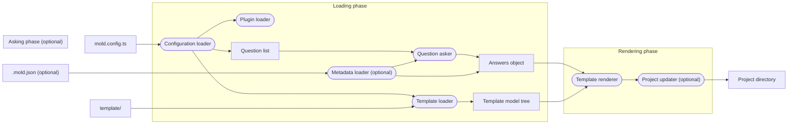

<!--
Copyright (c) 2023 Sophie Katz

This file is part of Mold.

Mold is free software: you can redistribute it and/or modify it under the terms of the GNU
General Public License as published by the Free Software Foundation, either version 3 of the
License, or (at your option) any later version.

Mold is distributed in the hope that it will be useful, but WITHOUT ANY WARRANTY; without even
the implied warranty of MERCHANTABILITY or FITNESS FOR A PARTICULAR PURPOSE. See the GNU General
Public License for more details.

You should have received a copy of the GNU General Public License along with Mold. If not, see
<https://www.gnu.org/licenses/>.
-->

# Developer overview

## How to set up project

To start developing Mold you must have these installed on your system:

- Node.JS 20.x installed
- Yarn 4.x installed

Clone this repository and then follow these commands:

```shell
# From the `mold` project root, install project dependencies
yarn install

# Run the project in development mode
yarn run dev --help
```

## Scripts

[`package.json`](../../package.json) provides a number of scripts:

| Script          | Description                                                                          |
| --------------- | ------------------------------------------------------------------------------------ |
| `start`         | Run Mold in production mode. Requires `build` to be run to pick up any code changes. |
| `dev`           | Run Mold in development mode. Runs the code as it is changed without building.       |
| `build`         | Builds Mold for production mode.                                                     |
| `clean`         | Cleans the production build.                                                         |
| `format`        | Formats all of the code.                                                             |
| `lint:tsc`      | Use the TypeScript compiler for linting.                                             |
| `lint:eslint`   | Use ESLint for linting.                                                              |
| `lint:prettier` | Use Prettier for style linting.                                                      |
| `lint`          | A combination script to run all `lint:*` scripts.                                    |
| `test`          | Run unit and integration tests.                                                      |
| `ci`            | A combination script to run `lint` and then `test`.                                  |

## Workflow



## Inputs

- `mold.config.ts` - The configuration file, which is loaded by `ConfigurationLoader` into a
  `Configuration` object.
- `.mold.json` - A metadata file which is stored in the project directory after template rendering.
  It is loaded by `MetadataLoader` into a `Metadata` object (if the file exists).
- `template/` - The template source directory containing raw and Handlebars-syntax files. It is
  loaded by `TemplateLoader` into a `Template` object.

## Questions

An array of `Question` objects is stored in `Configuration`. These are passed along to
`QuestionAsker` along with `Metadata` (if any). Any questions that do not have answers in the
metadata will be asked to the user.

The result of this is an answer object, which is a mapping of question key names to answer values.

## Plugins

`PluginLoader` loads any plugins referenced in `Configuration` and injects them appropriately into
the Mold runtime.

## Rendering

`TemplateRenderer` takes a `Template` object and an answer object as inputs. It renders the template
with Handlebars-syntax files evaluated using the answer object. It outputs a `Project` object which
is a representation of the files to be outputted to the project directory.

- During project creation, the results are written to the project directory as output by
  `ProjectDiffWriter`.
- During project checking or updating, the results are kept in memory and passed along to
  `ProjectComparer`.

## Project comparing

`ProjectComparer` takes in two `Project` objects as input. One is the result of project rendering
taken from `TemplateRenderer`. The other is a representation of the project directory that was
already created. This is loaded by `ProjectLoader`.

It outputs a `ProjectDiff` object which is then written to the filesystem by `ProjectDiffWriter`.

## Rules

`RuleBase` objects are kept in the `Configuration` object. These are executed in order when
checking or updating a project.
